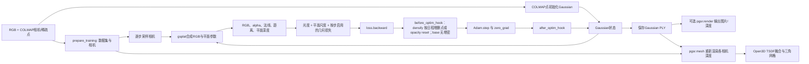

# PGSR 论文—代码地图与算法流程

源码基准：官方 `zju3dv/PGSR@de24f1a38b350387e8d8fe381b2cd70c1ae946e7`、重构 `yindaheng98/PGSR-python@497f926782753558c2f0d5d19c0234088c52a058`。安装的 `pgsr==1.0.0` 与发布提交的 31 个 Python 文件对应；依赖为 `gaussian-splatting==2.8.4`。论文依据是 [PGSR 论文公开页](https://arxiv.org/abs/2406.06521) 的第 IV-A 节及图 2、图 4、图 6；根目录 `PGSR.pdf` 是本地副本，不纳入 Git。整体整合与差异审计见 `notes/library_audit.md`，本机张量/运行证据见 `notes/tensor_trace.md`、`notes/experiment_log.md`。静态源码推断与已运行观察在下文分别注明。

图中 `before_optim_hook` 是 backward 后、Adam 更新前的训练器钩子；`densify` 模式才按日程执行增删点或 opacity reset，`base` 模式没有增密。训练到保存 PLY、`pgsr.render` 重载后的全视角渲染，以及 `pgsr.mesh` 重新渲染深度并生成 TSDF 网格，均已用 Truck-320 短实验观察。特别是 `pgsr.mesh` 不读取 `pgsr.render` 的图片作为必需输入，而是载入 PLY 后再次对数据集相机调用模型。网格执行与结构检查通过，不代表短训练后的表面质量已收敛。

| 论文/流程环节 | 重构库实现 | 官方参照 | 本机证据范围 |
| --- | --- | --- | --- |
| 已标定 RGB 与相机 | `pgsr/train.py:prepare_training` → `gaussian_splatting.prepare.prepare_dataset` → `ColmapCameraDataset` | `scene/dataset_readers.py`、`scene/cameras.py` | 观察：251 张、`[3,178,320]` |
| COLMAP 点初始化 | `pgsr/prepare.py:prepare_gaussians` → `gaussian_splatting.dataset.colmap.colmap_init` | `scene/gaussian_model.py` | 观察：初始 136,029 个；使用标记过的 CPU 三近邻尺度初始化 |
| 扁平 Gaussian 与平面法线 | `pgsr/gaussian_model.py:plane_params`；2DGS 变体 `pgsr/models/gsplat_2dgs.py:plane_params` | `scene/gaussian_model.py:145-158` | 两 backend 前向/反向已观察；逐点数值等价未测 |
| RGB、法线、距离与深度 | `pgsr/models/gsplat.py:GsplatPGSRGaussianModel.render`、`render_plane` | `gaussian_renderer/__init__.py:131-175`、`diff-plane-rasterization/forward.cu:359-405` | 张量形状已观察；官方逐像素对照未测 |
| 单视图/多视图约束 | `pgsr/trainer/scale.py`、`depth_normal_consistency.py`、`multi_view/`、`reprojection.py` | 官方 `train.py:177-330` | 短实验已观察非零损失与梯度；实现差异见审计报告 |
| 反向、优化与增密 | `pgsr/trainer/combinations.py` 组装；`gaussian_splatting/trainer/abc.py` 驱动一步；`densifier/` 与 `pgsr/trainer/trim/` 处理数量 | 官方 `train.py:332-392`、`scene/gaussian_model.py:415-506` | 观察：1500 步，136,029→423,230；各删点原因未单独计数 |
| 保存/渲染/网格 | `gaussian_splatting.train.training` 保存 PLY；`pgsr.render` 可独立输出；`pgsr.mesh` → `gaussian_splatting.mesh.extract_mesh` | 官方 `render.py:77-168` | S05 重载 iteration 1500 PLY 并渲染 251 帧；S06 再次逐相机渲染、融合为两份有限非空 mesh |

## “光度 + 平面尺度 + 按步启用的几何损失”到底是什么

论文图 4 将颜色拟合与几何约束并列；第 IV-A 节式 (1) 要压小 Gaussian 的最短尺度，使体椭球更接近局部平面。官方 `train.py:168-196,211-330` 把这些项加到一个标量损失。重构不是一段很长的训练循环，而在 `pgsr/trainer/combinations.py:PGSRTrainerWrapper` 依次把基础训练器包在 `PlanarScaleTrainerWrapper`、`DepthNormalConsistencyTrainerWrapper`、`MultiViewPhotometricGeometricTrainerWrapper`、`VirtualCameraReprojectionTrainerWrapper` 中。每层 `loss()` 先调用 `super().loss()` 再添加自己的项；一次 forward 的输出字典在这些层间传递。

1. **光度项**由共享库 `gaussian_splatting/trainer/base.py:BaseTrainer.loss` 实现，默认 `L_photo=(1−λ)L1(Ĉ,C)+λ(1−SSIM(Ĉ,C))`，`λ=0.2`。`Ĉ=out["render"]`，`C=camera.ground_truth_image`，都是 `[3,H,W]`。这一项沿袭 3DGS，不是 PGSR 的无偏深度创新。官方默认还可选外观/曝光补偿；当前重构 PGSR 训练链未对应移植该可选模型。
2. **平面尺度项**由 `pgsr/trainer/scale.py:PlanarScaleTrainer.loss` 对当前可见 Gaussian 的 `min(sx,sy,sz)` 求均值，默认乘 100，与论文式 (1) 及官方 `train.py:177-182` 对应。其目的是把最短轴压薄；最短轴方向随后定义局部平面法线。可见索引来自 rasterizer 的 `visibility_filter`。
3. **深度—法线一致性**由 `pgsr/trainer/depth_normal_consistency.py:DepthNormalConsistencyTrainer.loss` 比较 `render_normals` 与从 `depth` 的邻近反投影点求得的 `normals_from_depth`。RGB 边缘处权重较低，以免跨几何边界强迫局部平面一致；默认 `curr_step>7000` 才加入，权重 0.015。本机固定 checkpoint 的开/关测试在 2026-10-02 重检：单项损失 `0.017462491989135742`，对 `_xyz` 的梯度范数 `0.004385402891784906`；原始 JSON 为 `outputs/logs/normal_gradient_recheck_20261002.log`，精确命令见 `notes/experiment_log.md` 的 S03-R。
4. **多视图几何/光度**在 `pgsr/trainer/multi_view/trainer.py` 缓存渲染深度、筛邻视角；`multi_view/reprojction/geometric.py` 约束往返重投影 UV，`photometric.py` 以平面参数构造邻视图 patch 的单应变换并计算 NCC。默认从第 7000 步启用；有无有效邻居和像素也决定实际值。本机把门槛提前到 100 的学习实验，观察到非零贡献和 `_xyz` 梯度。
5. **虚拟相机重投影**由 `pgsr/trainer/reprojection.py` 在可见区域附近构造虚拟相机并约束重投影，默认从第 7000 步启用。本库默认套入该层，而官方 `use_virtul_cam` 默认关闭，故两者默认损失并不完全一样。

S04 在 step 1500 对某个采样相机的 trace 记录了光度 `0.07797`、平面尺度 `0.14092`、深度法线 `0.01215`、多视图 `0.03503`、虚拟相机 `0.00109`。它们只是该步的损失贡献，不是论文评测指标；详见 `outputs/truck-densify1500/training-summary.json`。S03 初版 trace 的深度法线列因插桩持有被 `+=` 改写的张量而错误，应以独立开/关测试和修正后的 S04 trace 为准。

## “backward + optimizer”如何改动模型

`pgsr/train.py` 调用共享 `gaussian_splatting.train.training`。后者每步选一张相机，调用 `AbstractTrainer.step`（共享库 `trainer/abc.py`）：**先**递增步数/调整 XYZ 学习率、预处理相机、渲染、累加上述损失；**再** `loss.backward()`、`before_optim_hook`、`optimizer.step()`、`zero_grad()`、`after_optim_hook`。`BaseTrainer` 创建六组 Adam 参数：世界坐标 `_xyz`、SH DC/其余系数、opacity logit、log-scale、rotation 四元数。光度梯度主要从 RGB 的 SH/alpha/位置等路径回传；几何梯度还沿 `depth`、法线、距离、重投影路径回到中心/尺度/旋转/opacity。不能凭一个梯度范数推断每组参数都在每步变化。

在 `densify` 模式，`before_optim_hook` 还可在 backward **之后**根据屏幕梯度与可见性构造 split/clone/prune/trim 指令，由共享 `DensificationTrainer` 同步改 Gaussian 张量和 Adam 状态；opacity reset 有另一日程。本轮观察到点数增加及第 1000 步 `Multi-view trim` 扫描，但没有逐项记录移除/替换点数。reset 默认第 3000 步开始，本次 1500 步没有到该门槛。PLY 只保存 Gaussian 参数，不保存 Adam 状态；重新载入可用于渲染或开启新训练，但不是无损续训。

## Nonbiased depth rendering 如何在代码和训练中体现

论文第 IV-A 节式 (2)–(4) 与图 2、图 6 描述：每个 Gaussian 的最短轴给法线 `n_i`，先用与 RGB 相同的前向透射率/alpha 权重 `w_i=α_i∏_{j<i}(1−α_j)` 合成像素法线 `N=Σw_i n_i` 和相机原点到平面的距离 `D=Σw_i d_i`，再让像素射线与合成平面求交。若 `r=K⁻¹[u,v,1]ᵀ` 且 `r_z=1`，交点的相机 z 深度为 `z=D/(N·r)`，正负号取决于法线与有符号距离的定义。重构 `plane_params` 使法线朝相机，距离取非负值，因此 `pgsr/models/gsplat.py:render_plane` 使用 `z=−D/(N·r+ε)`。官方 CUDA `forward.cu:393-405` 采用对应的负号。它不是 `gsplat` 的 `RGB+ED` 模式附带的期望深度值；重构只从该 rasterizer 输出的 `3:7` 通道取平面参数，再单独计算 PGSR `depth`。

“无偏”在论文这里有**具体的几何含义**：对单一扁平平面，法线和距离都乘同一 alpha 权重，求比值时共同权重可约掉；平面射线交点也与扁平 Gaussian 的表面一致。直接 alpha 加权 Gaussian 中心的 z 值，尤其累计权重不足 1 或平面倾斜时，可能向相机侧偏移或偏离盘面。这不是对任意多表面遮挡、噪声、退化分母都具有统计无偏保证。最短轴的 `argmin` 本身也不是连续可微选择；一旦选定当前轴，法线/距离/深度的后续运算是可微的。

训练中这个深度不是只在最后导出：`DepthNormalConsistencyTrainer` 用它重建法线；多视图缓存与几何重投影、虚拟相机重投影使用它；底层 rasterizer 将这些损失的梯度传回 Gaussian 参数。官方 CUDA 的 `backward.cu:474-480,563-576` 显式处理商法则及平面通道梯度；重构版 `render_plane` 的 PyTorch 运算和 gsplat autograd 完成对应反向。本机 S03 的几何项开/关梯度测试证明了重构版至少一条这样的训练路径，但尚未证明与官方 CUDA 梯度逐元素相等。

## 从 checkpoint 到 TSDF mesh：源码路径与当前运行证据

`python -m pgsr.mesh -s SCENE -d OUTPUT -i N --backend gsplat` 从 `OUTPUT/point_cloud/iteration_N/point_cloud.ply` 加载 Gaussian，`pgsr/render.py:prepare_rendering` 重建相机数据集与模型，随后调用依赖 `gaussian_splatting/mesh.py:extract_mesh`。它把 `gaussians.active_sh_degree` 设为 0，逐相机执行 `gaussians(camera)`，读取**PGSR 平面深度** `out["depth"]` 和渲染 RGB；按 `min_depth/max_depth` 及可选图像 mask 去掉无效深度。然后为每张图创建 Open3D 的 RGBD 图像（深度 float32、`depth_scale=1`），使用相机 `K` 与 world-to-camera 外参 `camera.world_view_transform.T` 融入 `ScalableTSDFVolume`。TSDF 在体素中累积不同视角的截断有符号距离，零等值面三角化得到 `fuse.ply`；连通片过滤后写 `fuse_post.ply`。颜色来自渲染 RGB，而非输入 LiDAR。

S05 已执行 `pgsr.render` 验证重载与渲染：命令为 `/mnt/e/PGSR/.envs/pgsr-1.0.0/bin/python scripts/study_driver.py pgsr.render -s /mnt/e/PGSR/data/truck-320 -d /mnt/e/PGSR/outputs/truck-densify1500 -i 1500 --backend gsplat --no_image_mask`，日志见 `outputs/logs/render1500.log`。它从 `point_cloud/iteration_1500/point_cloud.ply` 加载模型，251/251 个 Truck-320 相机视角完成渲染；输出目录 `ours_1500/` 含 251 张 RGB、251 张 GT、251 张逆深度 TIFF 以及 251 行 `quality.csv`。torch 已分配/已保留显存峰值为 426.5/602.0 MiB。该 PLY 来自 S04，继承其明确记录的 CPU 3-NN 初始尺度 workaround，因而运行属于学习实验而非基线复现。

另用 `scripts/export_geometry_samples.py` 对相机索引 0、125、250 抽查 PGSR 平面深度，默认 `max_depth=10`；manifest 位于 `outputs/truck-densify1500/acceptance/geometry/manifest.json`。脚本按 `finite & (depth > 0.1) & (depth <= 10)` 统计有效像素，三个视角的有效占比分别为 62.71%、72.66%、68.76%，深度 p01/p50/p95（COLMAP 场景坐标尺度，不是米）分别为 `2.023/3.071/8.057`、`1.956/3.337/7.788`、`1.535/3.938/6.262`。这只是三帧抽样；有限深度占比 100% 不代表所有像素都有效，也不能据此断言全数据集的深度范围。它为 `max_depth=10` 提供初步抽样依据，但不替代 mesh 融合后的检查。

共享实现默认 `depth_trunc=min(max_depth,2·scene_extent)`、`voxel_size=voxel_size_scale·depth_trunc/mesh_res`、`sdf_trunc=5·voxel_size`，默认 `mesh_res=1024`；S06 实际执行 `max_depth=10, mesh_res=256`，Truck 的 `scene_extent≈5.8434`，故得到深度截断 10、体素边长 0.0390625、SDF 截断 0.1953125（COLMAP 场景单位）。Open3D 融合 251/251 帧，`fuse.ply` 和 `fuse_post.ply` 分别有 1,348,676/1,688,137 与 455,965/819,553 个顶点/三角面，所有顶点坐标有限；命令和可视化界限见 `notes/mesh_acceptance.md`。官方 `render.py:77-168` 也是训练视角渲染平面深度再做 Open3D TSDF，但默认固定 `voxel_size=.002`、`sdf_trunc=4·voxel_size`、uint16 深度乘 1000、`depth_scale=1000`，并可选深度角度过滤。两者同属 TSDF 思路，参数和输入编码不同，不能期待逐面相同。**S05/S06 已验证执行链路与网格结构，不证明视觉质量收敛。**

| 若数据集有 LiDAR | 从 PGSR checkpoint 融合 | 直接从 LiDAR 建网格 |
| --- | --- | --- |
| 几何来源 | RGB 优化出的 Gaussian，在相机视角合成稠密平面深度 | 实测点/量程；若传感器有标定，通常保留物理尺度 |
| 建面所需 | PLY、相机内外参、有效渲染深度、合适体素/截断值 | 多帧精确配准、去噪；TSDF 需逐帧 range/depth 图和位姿，Poisson 等点云方法需可靠法线 |
| 常见取舍 | 可借多视图 RGB 拟合填补视觉可见区域，但继承 COLMAP 尺度/位姿与模型几何误差 | 不经视觉模型推测表面，但受扫描线密度、遮挡、反射/透明材质与视角覆盖限制 |
| 颜色 | 可从 Gaussian 渲染 RGB 融合 | 需有彩色 LiDAR，或相机—LiDAR 外参、时间同步和可见性处理 |

所以“有 LiDAR 就可直接 mesh”在几何上成立，但**点集本身不含三角拓扑**。可以对已配准的点云估计法线后用 Poisson/BPA 等重建，或把逐帧 LiDAR range 图投到 TSDF；方法选择取决于点密度、扫描方式及是否要保持实测尺度。LiDAR 的原始 `range` 常是沿光束的欧氏距离，而这里的 PGSR `depth` 是相机 z 值；若把量程投成 Open3D 相机深度图，必须用内外参和射线方向转换，不能把数值原样塞给 TSDF。现有 `pgsr.mesh` **只取 `out["depth"]`**，不会自动把 LiDAR 点云或真值深度当成 TSDF 输入。若希望联合 PGSR 与 LiDAR，还需先统一坐标/尺度与相机—LiDAR 标定，再设计深度监督或独立融合路径。
